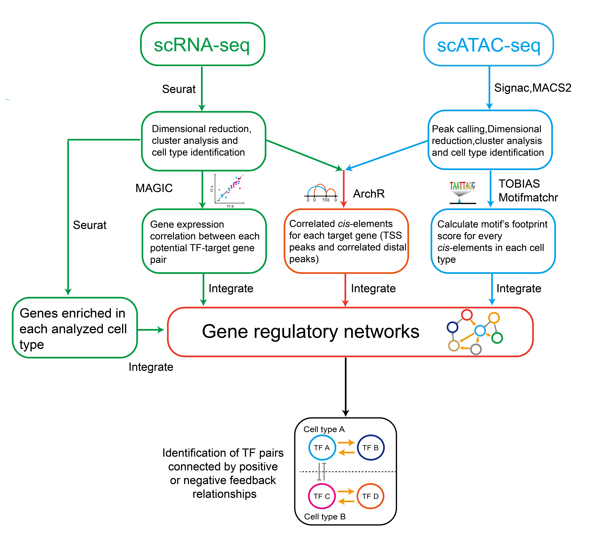

# IReNA-v2
### Constructing gene regulatory networks by integrating scRNA-seq and scATAC-seq data


 <div align="center">
 
 </div>

## STEP 0:Before following the IReNA-v2 analysis pipeline
The pipeline developed in R environment. We use E14-E16 scRNAseq/scATACseq datasets as example datasets. Seurat objects and ArchR objects can be downloaded by google drive: [Example datasets](https://drive.google.com/drive/folders/1BMwEuVM72ThIJj5MwqUAmGuhcvN-WChF?usp=sharing)

### S0-1 load required packages
``` r
library(Seurat)
library(ArchR)
```


## STEP 1:Selecting candidate genes
The DEGs were used as candidate genes for GRNs construction. For each developmental process which we aim to investigate in mouse and human, we identified the enriched genes for each cell type using the function ‘FindMarkers’ in Seurat. In constructing the GRNs of progenitors transition, the following parameters of ‘FindMarkers’ were used: min.pct = 0.05, logfc.threshold = 0.20, only.pos = TRUE, p-adjust < 0.01. In constructing GRNs regulating neurogenesis, the following parameters of ‘FindMarkers’ were used: min.pct = 0.1, logfc.threshold = 0.25, only.pos = TRUE and p-adjust < 0.01.

### S0-1 load required packages
``` r
library(Seurat)
library(ArchR)
```


## STEP 2:Identifying significant peak-to-gene links
We used the ArchR package to identify the significant peak-to-gene links. First, we integrated the age-matched scRNA-seq and scATAC-seq datasets for each time point using unconstrained Integration method with the function ‘addGeneIntegrationMatrix’. Then, using the function ‘addPeak2GeneLinks’, we calculated the correlation between accessibility peak intensity and gene expression.

``` r
load('E14_E16_RNA_seurat')

library(future)
plan("multiprocess", workers = 30)
options(future.globals.maxSize = 10000 * 1024^2)

Markers = FindAllMarkers(E14_E16_RNA_seurat,min.pct=0.1,logfc.threshold=0.2)

```

## STEP 3:Identifying the potential cis-regulatory elements for each candidate gene
We identified potential cis-regulatory elements for each candidate gene based on their location and the peak-to-gene links from Step2. We first classified all peaks into three categories according to their genomic location related to their potential target genes: 1) Promoter. 2) Gene body. 3) Intergenic. For the peaks in the promoter region,we treated all of them as correlated accessible chromatin regions (CARs) of their overlapping target genes. For the peaks in the gene body region, we defined them as CARs of their overlapping genes if they met the following criteria: 1) the distance between the peak and the TSS of its overlapping gene is < 100kb. 2) the links between the peak and its overlapping gene is significant.  For the peaks in the intergenic region, we first find their target genes and construct the peak-gene pairs if the target genes’ TSS are located within the upstream 100kb or downstream 100 kb of the intergenic peaks. Then we keep the peak-gene pairs if their peak-to-gene links are significant in step2. These peaks were identified as CARs of their gene pairs.

``` r
files = c(
	'/zp1/data/plyu3/Arrow_Project/E11_P8_combine_202010/ArrowFiles/E14.arrow',
	'/zp1/data/plyu3/Arrow_Project/E11_P8_combine_202010/ArrowFiles/E16.arrow'
	)
names(files) = c('E14','E16')


E14_E16_new_proj = ArchRProject(
  ArrowFiles = files,
  outputDirectory = "E14_E16_combine_202010",
  copyArrows = FALSE
)

getAvailableMatrices(E14_E16_new_proj)

E14_E16_new_proj_early = ArchR_Filter_proj(E14_E16_new_proj,cellnames)

load('Peak_set_GR_202009')

E14_E16_new_proj_early = addPeakSet_Matrix(E14_E16_new_proj_early,Peak_set_GR)

E14_E16_new_proj_early = Process_project(E14_E16_new_proj_early)

E14_E16_new_proj_early_p2g = Get_p2g_fun(E14_E16_new_proj_early)

E14_E16_new_proj_early_Pmat = ArchR_Get_the_peak_matrix(E14_E16_new_proj_early,binarize=T)

```

## STEP 4:Predicting cell-type specific TFs binding in cis-regulatory elements
With the cis-regulatory elements identified in Step 3, we next predicted the TF binding in these elements for each cell type with the PWMs extracted from TRANSFAC database. Firstly, we searching the motifs in all the cis-regulatory elements with the function ‘matchMotifs (p.cutoff = 5e-05)’ from the motifmatchr package. Then we filtered these motif regions according to their footprint score and their corresponding TF’s expression for each cell type.

To calculate the footprint score for each motif region in each cell type, we re-grouped the insertion fragments based on their origin of cell type and converted these cell-type-specific fragments into bam files using a custom script. Then we fed the bam files to TOBIAS software and obtained the bias-corrected Tn5 signal (log2(obs/exp)) with the default parameters except: ATACorrect --read_shift 0 0. Next, we calculated footprint scores including  NC, NL and NR for each motif's binding region. NC indicated the average bias-corrected Tn5 signal in the center of the motif. NL and NR indicated the average bias-corrected Tn5 signal in the left and right flanking regions of the motif, respectively. The flanking region is triple the size of the center region. We kept the motifs with the following criteria: NC < -0.1 and NL > 0.1 and NR > 0.1.

We further removed the motifs binding region for each cell type if the expression level of their corresponding TFs are not enriched in that cell type (from Step1).

``` r
load('Early_RPCS2_footprints_cl')
load('Early_EN_footprints_cl')
load('Early_ACHC_footprints_cl')
load('Early_Cone_footprints_cl')
load('Early_RGC_footprints_cl')


#### filtered motifs ########

library('GenomicRanges')
library("TFBSTools")
library("motifmatchr")

setwd('/zp1/data/plyu3/Finally_retinal_dev_202009/Figure5')
load(file='out_all_ext')
out_all_ext_add = data.frame(Motif = 'Atoh7_Chip', TFs='Atoh7')
out_all_ext = rbind(out_all_ext,out_all_ext_add)

####

setwd('/zp1/data/plyu3/Arrow_Project/New_Figure5_202009')
load('All_peaks_list_202009')
load('mm10_TSS_GR_all_202009')
load('E14_E16_new_proj_early_p2g')
load('Early_Diff_Genes_tab_202103')

summary(abs(E14_E16_new_proj_early_p2g$Correlation))
summary(abs(E14_E16_new_proj_early_p2g$FDR))

RPC_S2_sp_Genes = Early_Diff_Genes_tab$genes[which(Early_Diff_Genes_tab$RPC_S2 >0)]
E_N_sp_Genes = Early_Diff_Genes_tab$genes[which(Early_Diff_Genes_tab$E_N >0)]
AC_HC_sp_Genes = Early_Diff_Genes_tab$genes[which(Early_Diff_Genes_tab$'AC/HC' >0)]
RGC_sp_Genes = Early_Diff_Genes_tab$genes[which(Early_Diff_Genes_tab$RGC >0)]
Cone_sp_Genes = Early_Diff_Genes_tab$genes[which(Early_Diff_Genes_tab$Cone >0)]

All_genes_test = c(RPC_S2_sp_Genes,E_N_sp_Genes,AC_HC_sp_Genes,RGC_sp_Genes,Cone_sp_Genes)
All_genes_test = All_genes_test[!duplicated(All_genes_test)]

early_peak_gene_list = Selection_peaks_for_one(All_peaks_list,All_genes_test,E14_E16_new_proj_early_p2g,distance_F=100000,mm10_TSS_GR_all)


peak_gene_list = early_peak_gene_list

Output_CARs = function(peak_gene_list){
	#####
	temp1 = peak_gene_list[[1]]
	#####
	out1 = data.frame(DEGs = temp1$gene_name,CARs=temp1$peaks,Class='TSS',Correlation=as.character('TSS'))
	#####
	temp2 = peak_gene_list[[2]]
	#####
	out2 = data.frame(DEGs = temp2$gene_name,CARs=temp2$peaks,Class='GeneBody',Correlation=as.character(temp2$Correlation))
	#####
	temp3 = peak_gene_list[[3]]
	#####
	out3 = data.frame(DEGs = temp3$gene_name,CARs=temp3$peaks,Class='Intergenic',Correlation=as.character(temp3$Correlation))
	#####
	out = rbind(out1,out2,out3)
	#####
	return(out)
}

DEGs_CAR_table = Output_CARs(peak_gene_list)

load('Early_RPCS2_footprints_cl')
load('Early_EN_footprints_cl')
load('Early_ACHC_footprints_cl')
load('Early_Cone_footprints_cl')
load('Early_RGC_footprints_cl')

RPC_Reg_motif = Reg_one_cells_RPC_MG(Early_RPCS2_footprints_cl,early_peak_gene_list,out_all_ext,All_genes_test)
EN_Reg_motif = Reg_one_cells_RPC_MG(Early_EN_footprints_cl,early_peak_gene_list,out_all_ext,All_genes_test)
ACHC_Reg_motif = Reg_one_cells_RPC_MG(Early_ACHC_footprints_cl,early_peak_gene_list,out_all_ext,All_genes_test)
RGC_Reg_motif = Reg_one_cells_RPC_MG(Early_RGC_footprints_cl,early_peak_gene_list,out_all_ext,All_genes_test)
Cone_Reg_motif = Reg_one_cells_RPC_MG(Early_Cone_footprints_cl,early_peak_gene_list,out_all_ext,All_genes_test)


```

## STEP 5:Calculating gene-gene correlation
We calculated the expression correlations between all the expressed genes at the single-cell level. First, we extracted the cell-by-matrix from Seurat objects and filtered out the non-expressed genes in the matrix (rowSums < 10). Then we applied the MAGIC software to impute missing values and recover the gene interactions with the cell-by-gene matrix. The output matrix from MAGIC was used to calculate gene-gene correlation using the function ‘cor’ in R.  To identify the significant gene-gene correlations, we ranked all the gene-gene correlations (~1X10e8). The top 2.5% correlations were treated as significant positive correlations (p < 0.025) and the bottom 2.5% correlations were treated as significant negative correlations  (p < 0.025).

``` r
library('Seurat')
Reduction_Tag = 'umap'
Input_matrix_Tag='RNA'
dimsToUse = 1:30
k=30

GRNmo_Smoothing_MAGIC(E14_E16_RNA_seurat_choose,'harmony','RNA','Early_MAGIC_td1_UMAP_202107',1:30,k=30,td=1,"/zp1/data/plyu3/Arrow_Project/New_Figure5_202009")


Early_MAGIC = readRDS('/zp1/data/plyu3/Arrow_Project/New_Figure5_202009/Early_MAGIC_td1_UMAP_202107_MAGIC_matrix.rds')


sparse.cor3 <- function(x){
    n <- nrow(x)
    cMeans <- colMeans(x)
    cSums <- colSums(x)
    # Calculate the population covariance matrix.
    # There's no need to divide by (n-1) as the std. dev is also calculated the same way.
    # The code is optimized to minize use of memory and expensive operations
    covmat <- tcrossprod(cMeans, (-2*cSums+n*cMeans))
    crossp <- as.matrix(crossprod(x))
    covmat <- covmat+crossp
    sdvec <- sqrt(diag(covmat)) # standard deviations of columns
    covmat/crossprod(t(sdvec)) # correlation matrix
}

Early_Corr = RNA_Corr_RPCMG_Add_cutoff(Early_MAGIC)

RPC_Reg_motif = Add_Cor_to_GRN_network_and_Filter(Early_Corr,RPC_Reg_motif,All_genes_test)
EN_Reg_motif = Add_Cor_to_GRN_network_and_Filter(Early_Corr,EN_Reg_motif,All_genes_test)
ACHC_Reg_motif = Add_Cor_to_GRN_network_and_Filter(Early_Corr,ACHC_Reg_motif,All_genes_test)
RGC_Reg_motif = Add_Cor_to_GRN_network_and_Filter(Early_Corr,RGC_Reg_motif,All_genes_test)
Cone_Reg_motif = Add_Cor_to_GRN_network_and_Filter(Early_Corr,Cone_Reg_motif,All_genes_test)


RPC_S2_sp_Genes = Early_Diff_Genes_tab$genes[which(Early_Diff_Genes_tab$RPC_S2 >0)]
E_N_sp_Genes = Early_Diff_Genes_tab$genes[which(Early_Diff_Genes_tab$E_N >0)]
AC_HC_sp_Genes = Early_Diff_Genes_tab$genes[which(Early_Diff_Genes_tab$'AC/HC' >0)]
RGC_sp_Genes = Early_Diff_Genes_tab$genes[which(Early_Diff_Genes_tab$RGC >0)]
Cone_sp_Genes = Early_Diff_Genes_tab$genes[which(Early_Diff_Genes_tab$Cone >0)]

f1 = which(RPC_Reg_motif$TFs %in% RPC_S2_sp_Genes == T)
f2 = which(EN_Reg_motif$TFs %in% E_N_sp_Genes == T)
f3 = which(ACHC_Reg_motif$TFs %in% AC_HC_sp_Genes == T)
f4 = which(RGC_Reg_motif$TFs %in% RGC_sp_Genes == T)
f5 = which(Cone_Reg_motif$TFs %in% Cone_sp_Genes == T)

RPC_Reg_motif_cl = RPC_Reg_motif[f1,]
EN_Reg_motif_cl = EN_Reg_motif[f2,]
ACHC_Reg_motif_cl = ACHC_Reg_motif[f3,]
RGC_Reg_motif_cl = RGC_Reg_motif[f4,]
Cone_Reg_motif_cl = Cone_Reg_motif[f5,]

Motif_list = list(RPC_Reg_motif_cl,EN_Reg_motif_cl,ACHC_Reg_motif_cl,RGC_Reg_motif_cl,Cone_Reg_motif_cl)
names(Motif_list) = c('RPCs','EN','ACHC','RGC','Cone')

#####
#####

```


## STEP 6:Constructing gene regulatory networks
By integrating data from Step1-Step5, We constructed cell-type specific GRNs with the following procedure:
We first obtained the peak-target links from Step 3, and cell-type specific TF-peak links from Step 4.  We then merged these 2 types of links to the cell-type specific TF-peak-target relationships. Next, we classified these TF-peak-target relationships into activation or repression relationships based on the sign of the expression correlation between TF and target from Step 5. The significant positive/negative correlated TF-targets were selected as the active/repressive regulations respectively.
Finally, we removed all the duplicated TF-target regulatory relationships for each cell type and merged them to the final GRNs which were used for the downstream analysis.

``` r
Motif_list_cl = list()

for(i in 1:length(Motif_list)){
	print(i)
	temp_list = Motif_list[[i]]
	print(dim(temp_list))
	index = which(duplicated(temp_list$index) == T)
	temp_list_cl = temp_list[-index,]
	print(dim(temp_list_cl))
	Motif_list_cl = c(Motif_list_cl,list(temp_list_cl))
}

#####
#####
names(Motif_list_cl) = names(Motif_list)

Early_Motif_list_cl = Motif_list_cl
```

## STEP 7:Identifying and visualizing feedback TF pairs
With the GRNs constructed in the previous steps, we searched for TF pairs connected by either positive or negative feedback regulatory relationships. The TF pairs that activated each other were identified as ‘double positive’ pairs and the TF pairs repressed each other were identified as ‘double negative’ pairs. We visualized these feedback TFs pairs using Cytoscape software.

``` r
FoundFeedBackPairsOne <- function(tmp_motif1,tmp_motif2){
	##### Pos ###############
	k1 = which(tmp_motif1$Tag == 'pos')
	k2 = which(tmp_motif1$Tag == 'neg')
	tmp_motif1_pos = tmp_motif1[k1,]
	tmp_motif1_neg = tmp_motif1[k2,]
	##### Neg ###############
	k3 = which(tmp_motif2$Tag == 'pos')
	k4 = which(tmp_motif2$Tag == 'neg')
	tmp_motif2_pos = tmp_motif2[k3,]
	tmp_motif2_neg = tmp_motif2[k4,]
	##### Pos pairs ##########
	Pos_index1_rev = paste(tmp_motif1_pos$Target,tmp_motif1_pos$TFs)
	##### Overlapped only #########
	Pos_index1_rev_index = which(Pos_index1_rev %in% tmp_motif2_pos$index == T)
	print(length(Pos_index1_rev_index))
	if(length(Pos_index1_rev_index) > 0){
		Pos_index1_rev_res = tmp_motif1_pos[Pos_index1_rev_index,]
		Pos_index1_rev_res = Pos_index1_rev_res[!duplicated(Pos_index1_rev_res$index),]
		Pos_index1_rev_res = Pos_index1_rev_res[,c(1,6,9,8)]
	}else{
		Pos_index1_rev_res = data.frame(TFs = 'ND',Target='ND',Tag='ND',Cor=0)
	}
	##### Neg Pairs ##########
	Neg_index1_rev = paste(tmp_motif1_neg$Target,tmp_motif1_neg$TFs)
	Neg_index1_rev_index = which(Neg_index1_rev %in% tmp_motif2_neg$index == T)
	print(length(Neg_index1_rev_index))
	if(length(Neg_index1_rev_index) > 0){
		Neg_index1_rev_res = tmp_motif1_neg[Neg_index1_rev_index,]
		Neg_index1_rev_res = Neg_index1_rev_res[!duplicated(Neg_index1_rev_res$index),]
		Neg_index1_rev_res = Neg_index1_rev_res[,c(1,6,9,8)]
	}else{
		Neg_index1_rev_res = data.frame(TFs = 'ND',Target='ND',Tag='ND',Cor=0)
	}
	######
	Res = rbind(Pos_index1_rev_res,Neg_index1_rev_res)
	Res_nd = which(Res$TFs == 'ND')
	if(length(Res_nd) > 0){
		Res = Res[-Res_nd,]
	}
	return(Res)
}

#######
#### i and j are all both from 1 to length(Motif_list) ######
#######

FoundFeedBackPairs_new <- function(Motif_list){
	######
	Out_list = list()
	######
	for(i in 1:length(Motif_list)){
		for(j in 1:length(Motif_list)){
			print(c(i,j))
			Names_1 = names(Motif_list)[i]
			Names_2 = names(Motif_list)[j]
			print(c(Names_1,Names_2))
			tmp_motif1 = Motif_list[[i]]
			tmp_motif2 = Motif_list[[j]]
			#####
			tmp_out = FoundFeedBackPairsOne(tmp_motif1,tmp_motif2)
			tmp_out$celltypes = paste(Names_1,Names_2,sep=':')
			tmp_out$TFs = paste(Names_1,tmp_out$TFs,sep=':')
			tmp_out$Target = paste(Names_2,tmp_out$Target,sep=':')
			Out_list = c(Out_list,list(tmp_out))
		}
	}
	#######
	Out_list_out = do.call("rbind",Out_list)
}


Early_Feedback_res = FoundFeedBackPairs_new(Early_Motif_list_cl)
Early_Feedback_res = Early_Feedback_res[order(Early_Feedback_res$Cor),]

index = paste(Early_Feedback_res$TFs,Early_Feedback_res$Target,sep='::')

setwd('/zp1/data/plyu3/Human_retinal_scRNAseq')
save(Early_Feedback_res,file='Early_Feedback_res')

##
##### duplicated(index) #########
##

Process_the_Feedback_res = function(RPCMG_Feedback_res){
	#######
	sp_TFs = strsplit(RPCMG_Feedback_res$TFs,split=':',fixed=T)
	#######
	sp_Target = strsplit(RPCMG_Feedback_res$Target,split=':',fixed=T)
	#######
	RPCMG_Feedback_res$TF_index = sapply(sp_TFs,function(x) x[[1]])
	RPCMG_Feedback_res$TF_gene = sapply(sp_TFs,function(x) x[[2]])
	RPCMG_Feedback_res$Target_index = sapply(sp_Target,function(x) x[[1]])
	RPCMG_Feedback_res$Target_gene = sapply(sp_Target,function(x) x[[2]])
	#######
	RPCMG_Feedback_res$TF_target = paste(RPCMG_Feedback_res$TF_gene,RPCMG_Feedback_res$Target_gene,sep='::')
	######
	return(RPCMG_Feedback_res)
}

Early_Feedback_res = Process_the_Feedback_res(Early_Feedback_res)
```
